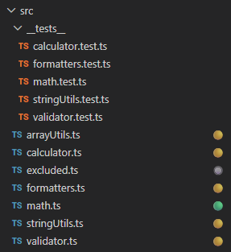
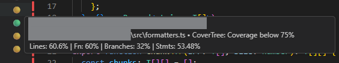
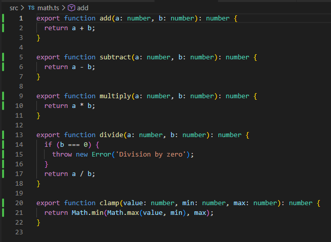
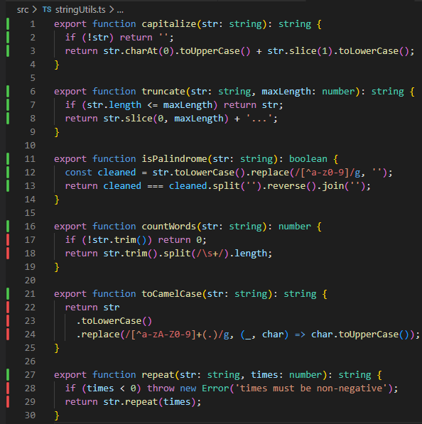

# CoverTree

[](https://github.com/WalSplitter/covertree-vscode/actions/workflows/ci.yml)
[](LICENSE)
[](https://code.visualstudio.com/)

VS Code extension that shows Jest/Vitest/NYC code coverage indicators next to files in the Explorer — and line-by-line in the editor gutter.

## Features

### Explorer Badges

Coverage status is shown directly in the file explorer — no need to open a report.



| Badge | Meaning                             |
| ----- | ----------------------------------- |
| 🔘    | No coverage data for this file      |
| 🟢    | Coverage ≥ threshold (default: 75%) |
| 🟡    | Coverage below threshold            |
| ❌    | Test failures detected              |

### Hover Tooltip with Details

Hovering a file shows the exact coverage breakdown across all four metrics.



### Editor Gutter Markers

Open any covered file and see line-level coverage directly in the editor gutter and overview ruler.

| Color     | Meaning                                  |
| --------- | ---------------------------------------- |
| 🟩 Green  | Line fully covered                       |
| 🟥 Red    | Line not covered                         |
| 🟨 Yellow | Partially covered (branch not fully hit) |

**Fully covered file:**



**Partially covered file:**



### Status Bar

Overall workspace coverage is shown in the status bar at all times. Click to refresh.

## Requirements

Your project must run Jest/Vitest with `json-summary` coverage reporter enabled:

```js
// jest.config.js / vitest.config.ts
{
  coverageReporters: ['json-summary', 'text', 'json'];
}
```

Then generate coverage data:

```bash
npx jest --coverage
# or
npx vitest run --coverage
```

This produces:

- `coverage/coverage-summary.json` — used for explorer badges and status bar
- `coverage/coverage-final.json` — used for editor gutter markers

## Configuration

Settings are defined in `package.json` under `contributes.configuration` and can be changed via **VS Code Settings** (`Ctrl+,` → search "CoverTree").

| Setting                       | Default                                                            | Description                                     |
| ----------------------------- | ------------------------------------------------------------------ | ----------------------------------------------- |
| `covertree.threshold`         | `75`                                                               | Minimum coverage % for green indicator          |
| `covertree.coverageFile`      | `coverage/coverage-summary.json`                                   | Path to coverage summary JSON                   |
| `covertree.detailFile`        | `coverage/coverage-final.json`                                     | Path to detailed coverage JSON (gutter markers) |
| `covertree.showGutterMarkers` | `true`                                                             | Enable/disable editor gutter markers            |
| `covertree.tool`              | `jest`                                                             | Coverage tool: `jest`, `vitest`, or `nyc`       |
| `covertree.include`           | `["**/*.ts","**/*.tsx","**/*.js","**/*.jsx"]`                      | File patterns to decorate                       |
| `covertree.exclude`           | `["**/node_modules/**","**/out/**","**/dist/**","**/coverage/**"]` | Patterns to skip                                |

## Commands

| Command                                  | Keybinding    | Description                                        |
| ---------------------------------------- | ------------- | -------------------------------------------------- |
| CoverTree: Refresh Coverage              | —             | Reload coverage data from disk                     |
| CoverTree: Go to Next Uncovered Line     | `Alt+Shift+N` | Jump to next uncovered line in the active file     |
| CoverTree: Go to Previous Uncovered Line | `Alt+Shift+P` | Jump to previous uncovered line in the active file |

## Development

```bash
npm install           # install deps
npm run compile       # compile TypeScript → out/
npm run watch         # watch mode
npm run lint          # lint src/
npm run type-check    # type check only
npm run format:check  # run format check
```

Press `F5` in VS Code to launch the Extension Development Host.

## How It Works

1. On activation, reads `coverage/coverage-summary.json` from each workspace folder
2. Registers a `FileDecorationProvider` for `.ts/.tsx/.js/.jsx` files
3. Reads `coverage/coverage-final.json` for line-level gutter decorations
4. Watches both files — decorations update automatically on change
5. Supports multi-root workspaces — one provider per folder
6. `covertree.refresh` forces a re-read of all providers

## License

MIT
